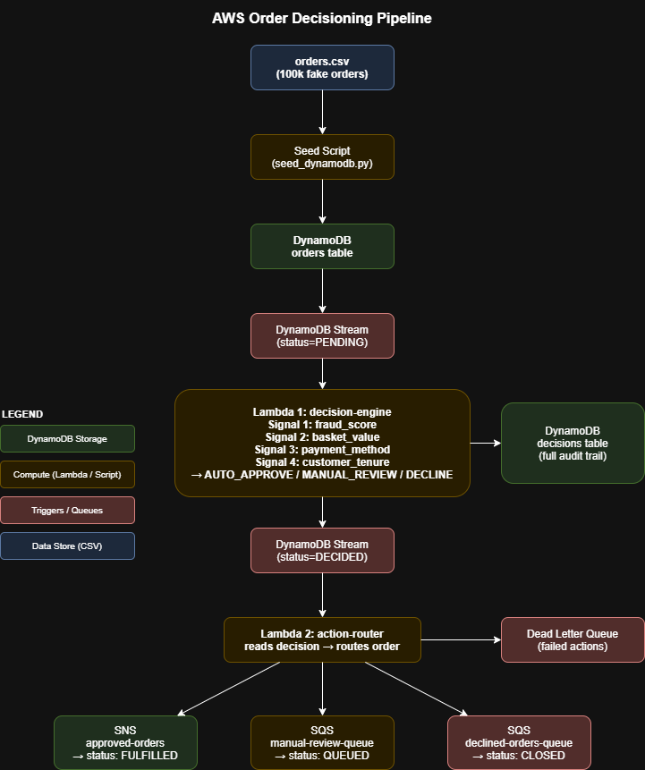

# Event-Driven Order Decisioning Pipeline

An event-driven pipeline on AWS that automatically approves, flags for review,
or declines customer orders based on multiple fraud and risk signals.

## Architecture



```
Orders (CSV) --> DynamoDB Orders Table --> Lambda 1 (Decision Engine)
                                                  |
                                                  v
                                          DynamoDB Decisions Table
                                          (audit trail of every decision)
                                                  |
                                                  v
                                          Lambda 2 (Action Handler)
                                                  |
                                                  v
                                  fulfil / queue for review / retry later
```

- **Lambda 1 (`decision-engine`)**: triggered by DynamoDB Streams on the
  `orders` table (filtered to `status == PENDING`). Decides
  `AUTO_APPROVE`, `MANUAL_REVIEW`, or `DECLINE` using four signals:
  fraud score, basket value, payment method, and customer tenure.
- **Lambda 2 (`action-router`)**: triggered by the same stream (filtered to
  `status == DECIDED`). Takes the corresponding downstream action:
  fulfil via SNS, queue for manual review via SQS, or route to the declined
  orders queue for a payment retry.
- Every decision is written back to the `decisions` table as a full audit
  record, including the reasoning behind it.

## Project structure

```
data/             Generated CSV datasets (100,000 fake orders with fraud anomalies)
lambdas/           Lambda function source code
  decision_engine.py  Lambda 1 - order decisioning
  action_router.py    Lambda 2 - downstream actions
infrastructure/    AWS CDK (Python) app defining all infrastructure
scripts/           Seed and test scripts (data generation, DynamoDB loaders, smoke tests)
architecture-diagram.png  System architecture diagram
```

## Tooling

This project was built with:
- Python 3.12
- AWS CDK 2.x (Python)
- AWS CLI v2
- DynamoDB, Lambda, SNS, SQS (all within AWS Free Tier limits)

## Cost envelope (AWS Free Tier)

This project is sized to stay within the AWS Free Tier at all times. Approximate
usage for the full 100,000-order seed run plus pipeline processing:

| Service | Free Tier allowance | This project's usage | Within Free Tier? |
|---|---|---|---|
| DynamoDB (provisioned capacity) | 25 RCU + 25 WCU per account, always free | 10 RCU + 10 WCU (`orders`: 5/5, `decisions`: 5/5) | Yes |
| DynamoDB Streams | No additional charge for reads triggering Lambda | ~100k stream records | Yes |
| Lambda requests | 1,000,000 free requests/month | ~200k invocations (2 Lambdas x 100k orders) | Yes |
| Lambda compute (GB-seconds) | 400,000 GB-seconds/month free | Well under (sub-second executions, 128-256MB) | Yes |
| SNS | 1,000 free publishes/month (email/HTTP), no charge for Lambda-triggered publishes within free request tier | ~tens of thousands of publishes (AUTO_APPROVE orders only) | Yes |
| SQS | 1,000,000 free requests/month | ~tens of thousands of messages (MANUAL_REVIEW + DECLINE orders) | Yes |
| CloudWatch Logs | 5GB ingestion + 5GB storage free/month | Structured JSON logs per decision, well under 5GB | Yes |

No always-on compute (no EC2, no NAT gateways, no provisioned-RCU spikes
beyond the temporary bulk-seed bump) is used anywhere in this stack.

> Note: during the initial 100k-record bulk seed, the `orders` table's write
> capacity was temporarily raised to 15 WCU (orders 15 + decisions 5 = 20 WCU,
> still under the 25 WCU free allowance) to avoid a multi-hour seed run, then
> scaled back down to 5 WCU afterward for steady-state use.

## Deploying

```powershell
cd infrastructure
pip install -r requirements.txt
cdk bootstrap --app "..\.venv\Scripts\python.exe app.py"   # first time only
cdk deploy --app "..\.venv\Scripts\python.exe app.py"
```

## Seeding data

```powershell
python scripts/generate_orders.py        # generates data/orders.csv (100k rows)
python scripts/seed_dynamodb.py          # uploads orders.csv into the orders table
```

## Tearing everything down

To remove every AWS resource created by this project (DynamoDB tables, Lambda
functions, SNS topic, SQS queues) in one step:

```powershell
cd infrastructure
cdk destroy --app "..\.venv\Scripts\python.exe app.py"
```

Both DynamoDB tables use `RemovalPolicy.DESTROY`, so `cdk destroy` deletes
all seeded order and decision data along with the infrastructure - there is
no manual cleanup step required, and nothing is left behind to incur cost.

## Status

- [x] Generate 100,000 fake orders with fraud anomalies
- [x] Define DynamoDB tables (Orders, Decisions) in CDK
- [x] Implement Lambda 1: decision engine
- [x] Implement Lambda 2: action handler
- [x] Wire Lambdas together (DynamoDB Streams)
- [x] Seed data into DynamoDB
- [x] Test end-to-end pipeline
- [x] Document signals, decision logic, and architecture diagram
